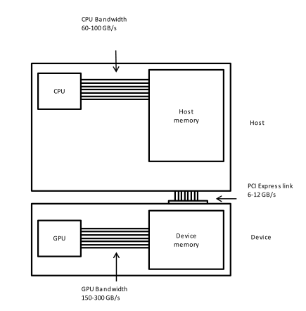

# Introduction to CuPy

[CuPy](https://cupy.dev) is a GPU array library that implements a subset of the NumPy and SciPy interfaces.
This makes it a very convenient tool to use the compute power of GPUs for people that have some experience with NumPy, without the need to write code in a GPU programming language such as CUDA, OpenCL, or HIP.

# Convolution in Python

We start by generating an artificial "image" on the host using Python and NumPy; the host is the CPU on the laptop, desktop, or cluster node you are using right now, and from now on we may use *host* to refer to the CPU and *device* to refer to the GPU.
The image will be all zeros, except for isolated pixels with value one, on a regular grid. The plan is to convolve it with a Gaussian and inspect the result.
We will also record the time it takes to execute this convolution on the host.

We can interactively write and executed the code in an iPython shell or a Jupyter notebook.

~~~
import numpy as np

# Construct an image with repeated delta functions
deltas = np.zeros((2048, 2048))
deltas[8::16,8::16] = 1
~~~
{: .language-python}

To get a feeling of how the whole image looks like, we can display the top-left corner of it.

~~~
import pylab as pyl
# Necessary command to render a matplotlib image in a Jupyter notebook.
%matplotlib inline

# Display the image
# You can zoom in using the menu in the window that will appear
pyl.imshow(deltas[0:32, 0:32])
pyl.show()
~~~
{: .language-python}

After executing the code, you should see the following image.

### Background
The computation we want to perform on this image is a convolution, once on the host and once on the device so we can compare the results and execution times.
In computer vision applications, convolutions are often used to filter images and if you want to know more about them, we encourage you to check out [this github repository](https://github.com/vdumoulin/conv_arithmetic) by Vincent Dumoulin and Francesco Visin with some great animations. We have already seen that we can think of an image as a matrix of color values, when we convolve that image with a particular filter, we generate a new matrix with different color values. An example of convolution can be seen in the figure below (illustration by Michael Plotke, CC BY-SA 3.0, via Wikimedia Commons).

In our example, we will convolve our image with a 2D Gaussian function shown below:

<!--
-->
$$G(x,y) = \frac{1}{2\pi \sigma^2} \exp\left(-\frac{x^2 + y^2}{2 \sigma^2}\right),$$
<!--
-->

where $x$ and $y$ are the "coordinates in our matrix, i.e. our row and columns, and $$\sigma$$ controls the width of the Gaussian distribution. Convolving images with 2D Gaussian functions will change the value of each pixel to be a weighted average of the pixels around it, thereby "smoothing" the image. Convolving images with a Gaussian function reduces the noise in the image, which is often required in [edge-detection](https://en.wikipedia.org/wiki/Gaussian_blur#Edge_detection) since most algorithms to do this are sensitive to noise.

> ## Maps and stencils
> It is often useful to identify the dataflow inherent in a problem. Say, if we want to square a list of numbers, all the operations are independent. The dataflow of a one-to-one operation is called a *map*.
> 
> {: style="width: 50%"}
> 
> A convolution is slightly more complicated. Here we have a many-to-one data flow, which is also known as a stencil.
> 
> {: style="width: 50%"}
> 
> GPU's are exceptionally well suited to compute algorithms that follow one of these patterns.
{: .callout}

# Convolution on the CPU Using SciPy
Let us first construct the Gaussian, and then display it. Remember that at this point we are still doing everything with standard Python, and not using the GPU yet.

~~~
x, y = np.meshgrid(np.linspace(-2, 2, 15), np.linspace(-2, 2, 15))
dst = np.sqrt(x*x + y*y)
sigma = 1
muu = 0.000
gauss = np.exp(-((dst-muu)**2/(2.0 * sigma**2)))
pyl.imshow(gauss)
pyl.show()
~~~
{: .language-python}

This should show you a symmetrical two-dimensional Gaussian.

Now we are ready to do the convolution on the host. We do not have to write this convolution function ourselves, as it is very conveniently provided by SciPy. Let us also record the time it takes to perform this convolution and inspect the top left corner of the convolved image.

~~~
from scipy.signal import convolve2d as convolve2d_cpu

convolved_image_using_CPU = convolve2d_cpu(deltas, gauss)
pyl.imshow(convolved_image_using_CPU[0:32, 0:32])
pyl.show()
%timeit -n 1 -r 1 convolve2d_cpu(deltas, gauss)
~~~
{: .language-python}

Obviously, the time to perform this convolution will depend very much on the power of your CPU, but I expect you to find that it takes a couple of seconds.

~~~
2.4 s ± 0 ns per loop (mean ± std. dev. of 1 run, 1 loop each)
~~~
{: .output}

When you display the corner of the image, you can see that the "ones" surrounded by zeros have actually been blurred by a Gaussian, so we end up with a regular grid of Gaussians.

# Convolution on the GPU Using CuPy

This is part of a lesson on GPU programming, so let us use the GPU.
Although there is a physical connection - i.e. a cable - between the CPU and the GPU, they do not share the same memory space.
This image depicts the different components of CPU and GPU and how they are connected:

This means that an array created from e.g. an iPython shell using NumPy is physically located into the main memory of the host, and therefore available for the CPU but not the GPU.
It is not yet present in GPU memory, which means that we need to copy our data, the input image and the convolving function to the GPU, before we can execute any code on it.
In practice, we have the arrays `deltas` and `gauss` in the host's RAM, and we need to copy them to GPU memory using CuPy.

~~~
import cupy as cp

deltas_gpu = cp.asarray(deltas)
gauss_gpu = cp.asarray(gauss)
~~~
{: .language-python}

Now it is time to do the convolution on the GPU.
SciPy does not offer functions that can use the GPU, so we need to import the convolution function from another library, called `cupyx`; `cupyx.scipy` contains a subset of all SciPy routines.
You will see that the GPU convolution function from the `cupyx` library looks very much like the convolution function from SciPy we used previously.
In general, NumPy and CuPy look very similar, as well as the SciPy and `cupyx` libraries, and this is on purpose to facilitate the use of the GPU by programmers that are already familiar with NumPy and SciPy.
Let us again record the time to execute the convolution, so that we can compare it with the time it took on the host.

~~~
from cupyx.scipy.signal import convolve2d as convolve2d_gpu

convolved_image_using_GPU = convolve2d_gpu(deltas_gpu, gauss_gpu)
%timeit -n 7 -r 1 convolved_image_using_GPU = convolve2d_gpu(deltas_gpu, gauss_gpu)
~~~
{: .language-python}

Similar to what we had previously on the host, the execution time of the GPU convolution will depend very much on the GPU used.
These are the results using a NVIDIA Tesla T4 on Google Colab.

~~~
98.2 µs ± 0 ns per loop (mean ± std. dev. of 1 run, 7 loops each)
~~~
{: .output}

This is a lot faster than on the host, a performance improvement, or speedup, of 24439 times.
Impressive, but is it true?

# Measuring performance

So far we used `timeit` to measure the performance of our Python code, no matter if it was running on the CPU or was GPU accelerated.
However, execution on the GPU is asynchronous: the control is given back to the Python interpreter immediately, while the GPU is still executing the task.
Because of this, we cannot use `timeit` anymore: the timing would not be correct.

CuPy provides a function, `benchmark` that we can use to measure the time it takes the GPU to execute our kernels.

~~~
from cupyx.profiler import benchmark

execution_gpu = benchmark(convolve2d_gpu, (deltas_gpu, gauss_gpu), n_repeat=10)
~~~
{: .language-python}

The previous code executes `convolve2d_gpu` ten times, and stores the execution time of each run, in seconds, inside the `gpu_times` attribute of the variable `execution_gpu`.
We can then compute the average execution time and print it, as shown.

~~~
gpu_avg_time = np.average(execution_gpu.gpu_times)
print(f"{gpu_avg_time:.6f} s")
~~~
{: .language-python}

Another advantage of the `benchmark` method is that it excludes the compile time, and warms up the GPU, so that measurements are more stable and representative.

With the new measuring code in place, we can measure performance again.

~~~
0.020642 s
~~~
{: .output}

We now have a more reasonable, but still impressive, speedup of 116 times over the host code.

> ## Challenge: convolution on the GPU without CuPy 
> 
> Try to convolve the NumPy array `deltas` with the NumPy array `gauss` directly on the GPU, without using CuPy arrays. 
> If this works, it should save us the time and effort of transferring `deltas` and `gauss` to the GPU.
>
> > ## Solution
> > 
> > We can directly try to use the GPU convolution function `convolve2d_gpu` with `deltas` and `gauss` as inputs.
> > ~~~
> > convolve2d_gpu(deltas, gauss)
> > ~~~
> > {: .language-python}
> > 
> > However, this gives a long error message ending with:
> > ~~~
> > TypeError: Unsupported type <class 'numpy.ndarray'>
> > ~~~
> > {: .output}
> >
> > It is unfortunately not possible to access NumPy arrays directly from the GPU because they exist in the 
> > Random Access Memory (RAM) of the host and not in GPU memory.
> >
> {: .solution}
{: .challenge}

# Validation

To check that we actually computed the same output on the host and the device we can compare the two output arrays `convolved_image_using_GPU` and `convolved_image_using_CPU`.

~~~
np.allclose(convolved_image_using_GPU, convolved_image_using_CPU)
~~~
{: .language-python}

As you may expect, the result of the comparison is positive, and in fact we computed the same results on the host and the device.

~~~
array(True)
~~~
{: .output}

> ## Challenge: fairer comparison of CPU vs. GPU
> 
> Compute again the speedup achieved using the GPU, but try to take also into account the time spent transferring the data to the GPU and back.
>
> Hint: to copy a CuPy array back to the host (CPU), use the `cp.asnumpy()` function.
>
> > ## Solution
> > 
> > A convenient solution is to group both the transfers, to and from the GPU, and the convolution into a single Python function, and then time its execution, like in the following example.
> > 
> > ~~~
> > def transfer_compute_transferback():
> >     deltas_gpu = cp.asarray(deltas)
> >     gauss_gpu = cp.asarray(gauss)
> >     convolved_image_using_GPU = convolve2d_gpu(deltas_gpu, gauss_gpu)
> >     convolved_image_using_GPU_copied_to_host = cp.asnumpy(convolved_image_using_GPU)
> >    
> > execution_gpu = benchmark(transfer_compute_transferback, (), n_repeat=10)
> > gpu_avg_time = np.average(execution_gpu.gpu_times)
> > print(f"{gpu_avg_time:.6f} s")
> > ~~~
> > {: .language-python}
> > ~~~
> > 0.035400 s
> > ~~~
> > {: .output}
> >
> > The speedup taking into account the data transfers decreased from 116 to 67.
> > Taking into account the necessary data transfers when computing the speedup is a better, and more fair, way to compare performance.
> > As a note, because data transfers force the GPU to sync with the host, this could also be measured with `timeit` and still provide correct measurements.
> {: .solution}
{: .challenge}

# A shortcut: performing NumPy routines on the GPU

We saw earlier that we cannot execute routines from the `cupyx` library directly on NumPy arrays.
In fact we need to first transfer the data from host to device memory.
Vice versa, if we try to execute a regular SciPy routine (i.e. designed to run the CPU) on a CuPy array, we will also encounter an error.
Try the following:

~~~
convolve2d_cpu(deltas_gpu, gauss_gpu)
~~~
{: .language-python}

This results in 
~~~
......
......
......
TypeError: Implicit conversion to a NumPy array is not allowed. Please use `.get()` to construct a NumPy array explicitly.
~~~
{: .output}

So SciPy routines cannot have CuPy arrays as input.
We can, however, execute a simpler command that does not require SciPy.
Instead of 2D convolution, we can do 1D convolution.
For that we can use a NumPy routine instead of a SciPy routine.
The `convolve` routine from NumPy performs linear (1D) convolution.
To generate some input for a linear convolution, we can flatten our image from 2D to 1D (using `ravel()`), but we also need a 1D kernel.
For the latter we will take the diagonal elements of our 2D Gaussian kernel.
Try the following three instructions for linear convolution on the CPU:

~~~
deltas_1d = deltas.ravel()
gauss_1d = gauss.diagonal()
%timeit -n 1 -r 1 np.convolve(deltas_1d, gauss_1d)
~~~
{: .language-python}

You could arrive at something similar to this timing result:
~~~
270 ms ± 0 ns per loop (mean ± std. dev. of 1 run, 1 loop each)
~~~
{: .output}

We have performed a regular linear convolution using our CPU.
Now let us try something bold.
We will transfer the 1D arrays to the GPU and use the NumPy routine to do the convolution.

~~~
deltas_1d_gpu = cp.asarray(deltas_1d)
gauss_1d_gpu = cp.asarray(gauss_1d)

execution_gpu = benchmark(np.convolve, (deltas_1d_gpu, gauss_1d_gpu), n_repeat=10)
gpu_avg_time = np.average(execution_gpu.gpu_times)
print(f"{gpu_avg_time:.6f} s")
~~~
{: .language-python}

You may be surprised that we can issue these commands without error.
Contrary to SciPy routines, NumPy accepts CuPy arrays, i.e. arrays that exist in GPU memory, as input.
[Here](https://docs.cupy.dev/en/stable/user_guide/interoperability.html#numpy) you can find some background on why NumPy routines can handle CuPy arrays. 

Also, remember when we used `np.allclose` with a NumPy and a CuPy array as input?
That worked for the same reason.

The linear convolution is actually performed on the GPU, which also results in a lower execution time.

~~~
0.014529 s
~~~
{: .output}

Without much effort, we obtained a 18 times speedup. 

# Expanding the shortcut, image processing for astronomy

In this section, we will perform the four major steps in image processing for astronomy: determination of background characteristics, segmentation, connected component labelling and source measurements. 

## Import the FITS image.

Start by importing a 2048² pixels image of the Galactic Center, an image made from observations by the Indian Giant Metrewave Radio Telescope (GMRT) at 150 MHz. 

~~~
from astropy.io import fits

with fits.open("GMRT_image_of_Galactic_Center.fits") as hdul:
    data = hdul[0].data.byteswap().newbyteorder()
~~~
{: .language-python}

The latter two methods are needed to convert byte ordering from big endian to little endian.

## Inspect the image.

Let us have a look at part of this image.

~~~
from matplotlib.colors import LogNorm

maxim = data.max()

pyl.matshow(data, cmap=pyl.cm.gray_r, norm=LogNorm(vmin = maxim/100, vmax=maxim))
pyl.colorbar()
~~~
{: .language-python}

That does not show the level of detail that we are looking for. Let us zoom in a bit.

~~~
subimage = data[500:1000, 500:1000]
maxim_sub = subimage.max()
pyl.matshow(subimage, cmap=pyl.cm.gray_r, \
            norm=LogNorm(vmin = maxim_sub/100, vmax=maxim_sub))
pyl.colorbar()
~~~
{: .language-python}

This shows us a few sources, with a bit more detail than just a single dot, but also the background noise:

## Determine the background characteristics of the image.

We want to identify all the sources - meaning e.g. stars, supernova remnants and distant galaxies - in this image and measure their positions and fluxes. How do we separate source pixels from background pixels? When do we know if a pixel with a high value belongs to a source or is simply a noise peak? We assume the background noise, which is a reflection of the limited sensitivity of the radio telescope, has a normal distribution. The chance of having a background pixel with a value above 5 times the standard deviation is 2.9e-7. We have 2²² = 4.2e6 pixels in our image, so the chance of catching at least one random noise peak by setting a threshold of 5 times the standard deviation is less than 50%. We refer to the standard deviation as \sigma.

How do we measure the standard deviation of the background pixels? First we need to separate them from the source pixels, based on their values, in the sense that high pixel values more likely come from sources. The technique we use is called \kappa, \sigma clipping. First we take all pixels and compute the standard deviation (\sigma). Then we compute the median and clip all pixels larger than median + 3 * \sigma and smaller than median - 3 * \sigma. From the clipped set, we compute the median and standard deviation again and clip again. Continue until no more pixels are clipped. The standard deviation from this final set of pixel values is the basis for the next step.

Before clipping, let us investigate some properties of our unclipped data.
~~~
mean_ = data.mean()
median_ = np.median(data)
stddev_ = np.std(data)
max_ = np.amax(data)
print(f"mean = {mean_:.3e}, median = {median_:.3e}, sttdev = {stddev_:.3e},\
maximum = {max_:.3e}")
~~~
{: .language-python}

The maximum flux density is 2506 mJy/beam, coming from the Galactic Center itself, so from the center of the image, while the overall standard deviation is 19.9 mJy/beam:

~~~
mean = 3.898e-04, median = 1.571e-05, sttdev = 1.993e-02,maximum = 2.506e+00
~~~
{: .output}

You might observe that \kappa, \sigma clipping is a compute intense task, that is why we want to do it on a GPU. But let's first issue the algorithm on a CPU.

This is the Numpy code to do this:

~~~
# Flattening our 2D data first makes subsequent steps easier.
data_flat = data.ravel()
# Here is a kappa, sigma clipper for the CPU
def kappa_sigma_clipper(data_flat):
    while True:
         med = np.median(data_flat)
         std = np.std(data_flat)
         clipped_lower = data_flat.compress(data_flat > med - 3 * std)
         clipped_both = clipped_lower.compress(clipped_lower < med + 3 * std)
         if len(clipped_both) == len(data_flat):
             break
         data_flat = clipped_both  
    return data_flat

data_clipped = kappa_sigma_clipper(data_flat)
timing_ks_clipping_cpu = %timeit -o kappa_sigma_clipper(data_flat)
fastest_ks_clipping_cpu = timing_ks_clipping_cpu.best
print(f"Fastest CPU ks clipping time = {1000 * fastest_ks_clipping_cpu:.3e} ms.")
~~~
{: .language-python}

~~~
793 ms ± 17.2 ms per loop (mean ± std. dev. of 7 runs, 1 loop each)
Fastest CPU ks clipping time = 7.777e+02 ms.
~~~
{: .output}

So that is close to 1 second to perform these computations. Hopefully, we can speed this up using the GPU.
How has \kappa, \sigma clipping influenced our statistics?

~~~
mean_ = data_clipped.mean()
median_ = np.median(data_clipped)
stddev_ = np.std(data_clipped)
max_ = np.amax(data_clipped)
print(f"mean = {mean_:.3e}, median = {median_:.3e}, sttdev = {stddev_:.3e},\
maximum = {max_:.3e}")
~~~
{: .language-python}

All output statistics have become smaller which is reassuring; it seems data_clipped contains mostly background pixels:

~~~
mean = -1.945e-06, median = -9.796e-06, sttdev = 1.334e-02,maximum = 4.000e-02
~~~
{: .output}

> ## Challenge: Now that you understand how the \kappa, \sigma clipping algorithm works, perform it on the GPU.
> 
> Also compute the speedup factor.
>
> > ## Solution
> > 
> > ~~~
> > data_flat_gpu = cp.asarray(data_flat)
> > data_gpu_clipped = kappa_sigma_clipper(data_flat_gpu)
> > timing_ks_clipping_gpu = benchmark(kappa_sigma_clipper, (data_flat_gpu.ravel(), ), n_repeat=10)
> > fastest_ks_clipping_gpu = np.min(timing_ks_clipping_gpu.gpu_times)
> > print(f"{1000 * fastest_ks_clipping_gpu:.3e} ms")
> > ~~~
> > {: .language-python}
> > ~~~
> > 5.571e+01 ms
> > ~~~
> > {: .output}
> >
> > ~~~
> > speedup_factor = fastest_ks_clipping_cpu/fastest_ks_clipping_gpu
> > print(f"The speedup factor for ks clipping is: {speedup_factor:.3e}")
> > ~~~
> > {: .language-python}
> > ~~~
> > The speedup factor for ks clipping is: 1.396e+01
> > ~~~
> > {: .output}
> {: .solution}
{: .challenge}

## Segment the image

We have seen that clipping at the 5 \sigma level of an image this size (2048² pixels) will yield a chance of less than 50% that from all the sources we detect at least one will be a noise peak. So let us set the threshold at 5 \sigma and segment it.
First check that we find the same standard deviation from our clipper on the GPU:

~~~
stddev_gpu_ = np.std(data_gpu_clipped)
print(f"standard deviation of background_noise = {stddev_:.4f} Jy/beam")
~~~
{: .language-python}
yields
~~~
standard deviation of background_noise = 0.0133 Jy/beam
~~~
{: .output}

~~~
threshold = 5 * stddev_
segmented_image = np.where(data > threshold, 1,  0)
timing_segmentation_CPU = %timeit -o np.where(data > threshold, 1,  0)
fastest_segmentation_CPU = timing_segmentation_CPU.best 
print(f"Fastest CPU segmentation time = {1000 * fastest_segmentation_CPU:.3e} ms.")
~~~
{: .language-python}

~~~
6.41 ms ± 55.3 µs per loop (mean ± std. dev. of 7 runs, 100 loops each)
Fastest CPU segmentation time = 6.294e+00 ms.
~~~
{: .output}

> ## Challenge: perform the segmentation on the GPU and compute the speedup.
> > ## Solution
> > 
> > ~~~
> > data_gpu = cp.asarray(data)
> > threshold = 5 * stddev_gpu_
> > segmented_image_gpu = np.where(data_gpu > threshold, 1,  0)
> > timing_segmentation_GPU = benchmark(np.where, (data_gpu > threshold, 1,  0), n_repeat=10)
> > fastest_segmentation_GPU = np.min(timing_segmentation_GPU.gpu_times)
> > print(f"{1000 * fastest_segmentation_GPU:.3e} ms")
> > print()
> > speedup_factor = fastest_segmentation_CPU/fastest_segmentation_GPU
> > print(f"The speedup factor for segmentation is: {speedup_factor:.3e}")
> > ~~~
> > {: .language-python}
> > This yields
> > ~~~
> > 3.298e-01 ms
> > 
> > The speedup factor for segmentation is: 1.908e+01
> > ~~~
> > {: .output}
> {: .solution}
{: .challenge}


