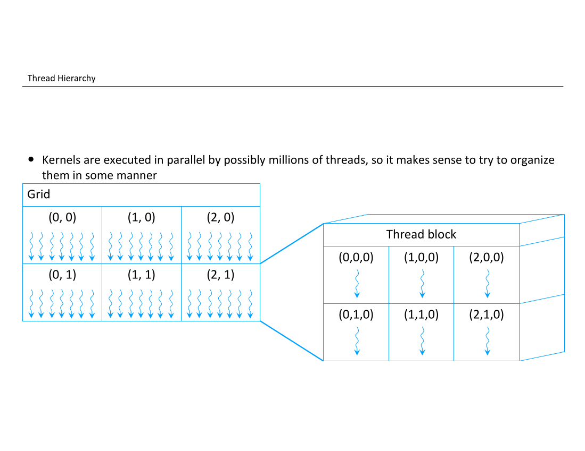

So far we have learned how to replace calls to NumPy and SciPy functions to equivalent ones running on the GPU using CuPy, and how to run some of our own Python functions on the GPU using Numba.
This was possible even without much knowledge of how a GPU works.
In fact, the only thing we mentioned in previous episodes about the GPU is that it is a device specialized in running parallel workloads, and that it is its own system, connected to our main memory and CPU by some kind of bus.

However, before moving to a programming language designed especially for GPUs, we need to introduce some concepts that will be useful to understand the next episodes.

# The GPU, a High Level View at the Hardware

Explain how a GPU is made: group of processors with many cores, no coherent memory, each processor can run code independently of the others, cores execute the same code.
# How Programs are Executed

Explain the model used to program GPUs that is based on running the same code, but dividing threads in groups, each group and thread having some kind of ID that makes it possible to differentiate execution.
This section is not CUDA specific yet, and can in principle be used for OpenCL and HIP.

# Different Memories

Explain that GPUs have many different memories, some accessible to both CPU and GPU, some accessible to all groups of threads, some to only threads in the same group, and some private to threads.


