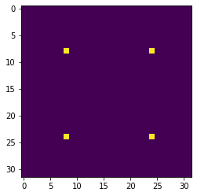
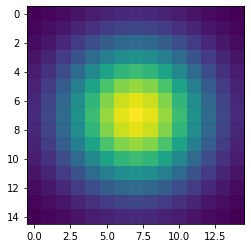
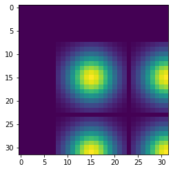
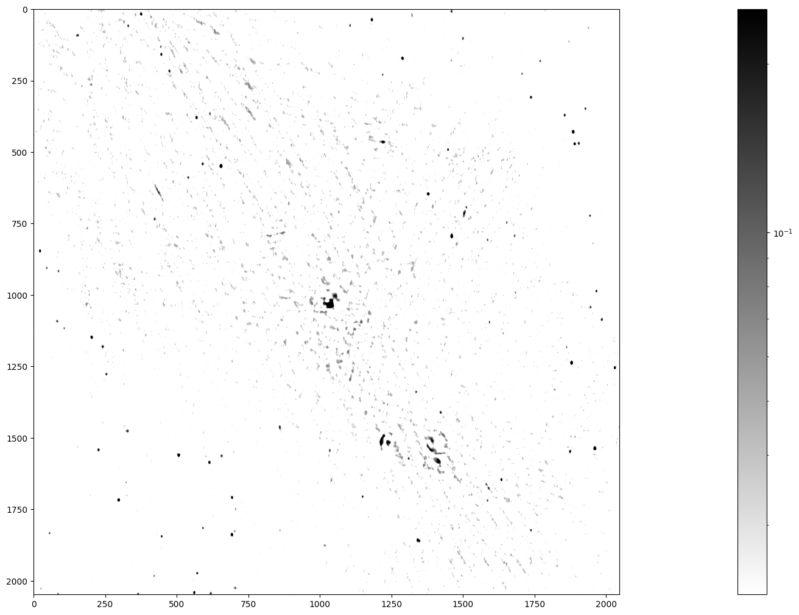

:::::: questions
- "How can I increase the performance of code that uses NumPy?"
- "How can I copy NumPy arrays to the GPU?"
::::::

:::::: objectives
- "Be able to indicate if an array, represented by a variable in an iPython shell, is stored in host or device memory."
- "Be able to copy the contents of this array from host to device memory and vice versa."
- "Be able to select the appropriate function to either convolve an image using either CPU or GPU compute power."
- "Be able to quickly estimate the speed benefits for a simple calculation by moving it from the CPU to the GPU."
::::::

# Introduction to CuPy

[CuPy](https://cupy.dev) is a GPU array library that implements a subset of the NumPy and SciPy interfaces.
Thanks to CuPy, people conversant with NumPy can very conveniently harvest the compute power of GPUs without writing code in GPU programming languages such as CUDA, OpenCL, and HIP.

From now on we can also use the word *host* to refer to the CPU on the laptop, desktop, or cluster node you are using as usual, and *device* to refer to the graphics card and its GPU.

# Convolutions in Python

We start by generating an image using Python and NumPy code.
We want to compute a convolution on this input image once on the host and once on the device, and then compare both the execution times and the results.

In an iPython shell or a Jupyter notebook, we can write and execute the following code on the host.
The pixel values will be zero everywhere except for a regular grid of single pixels having value one, very much like a Dirac's delta function; hence the input image is named `deltas`.

~~~python
import numpy as np

# Construct an image with repeated delta functions
diracs = np.zeros((2048, 2048))
diracs[8::16,8::16] = 1
~~~

We can display the top-left corner of the input image to get a feeling of how it looks like, as follows:

~~~python
import pylab as pyl
# Jupyter 'magic' command to render a Matplotlib image in the notebook
%matplotlib inline

# Display the image
# You can zoom in/out using the menu in the window that will appear
pyl.imshow(diracs[0:32, 0:32])
pyl.show()
~~~

and you should obtain the following image:

{alt='Grid of delta functions.'}

## Gaussian convolutions

The illustration below shows an example of convolution (courtesy of Michael Plotke, CC BY-SA 3.0, via Wikimedia Commons).
Looking at the terminology in the illustration, be forewarned that the word *kernel* happens to have different meanings that, inconveniently, apply to both mathematical convolution and coding on a GPU device.
To know more about convolutions, we encourage you to check out [this GitHub repository](https://github.com/vdumoulin/conv_arithmetic) by Vincent Dumoulin and Francesco Visin with some great animations.

{alt="Example of animated convolution"}

In this course section, we will convolve our image with a 2D Gaussian function, having the general form:

$$G(x,y) = \frac{1}{2\pi \sigma^2} \exp\left(-\frac{x^2 + y^2}{2 \sigma^2}\right)$$

where $x$ and $y$ are distances from the origin, and $\sigma$ controls the width of the Gaussian curve.
Since we can think of an image as a matrix of color values, the convolution of that image with a kernel generates a new matrix with different color values.
In particular, convolving images with a 2D Gaussian kernel changes the value of each pixel into a weighted average of the neighboring pixels, thereby smoothing out the features in the input image.

Convolutions are frequently used in computer vision to filter images.
For example, Gaussian convolution can be required before applying algorithms for [edge detection](https://en.wikipedia.org/wiki/Gaussian_blur#Edge_detection), which are sensitive to the noise in the original image.
To avoid conflicting vocabularies, in the remainder we refer to *convolution kernels* as *filters*.

::: callout
Identifying the dataflow inherent in an algorithm is often useful.
Say, if we want to square the numbers in a list, the operations on each item of the list are independent one of another.
The dataflow of a one-to-one operation is called a *map*.

{alt="Data flow of a map operation"}

A convolution is slightly more complex because of a many-to-one dataflow, also known as a *stencil*.

{alt="Data flow of a stencil operation"}

GPUs are exceptionally well suited to compute algorithms that follow either dataflow.
:::

## Convolution on the CPU Using SciPy

Let's first construct and then display the Gaussian filter.
Remember that we are still coding everything in standard Python, without using the GPU.

~~~python
x, y = np.meshgrid(np.linspace(-2, 2, 15), np.linspace(-2, 2, 15))
dist = np.sqrt(x*x + y*y)
sigma = 1
origin = 0.000
gauss = np.exp(-(dist - origin)**2 / (2.0 * sigma**2))
pyl.imshow(gauss)
pyl.show()
~~~

The code above produces this image of a symmetrical two-dimensional Gaussian:

{alt="Two-dimensional Gaussian"}

Now we are ready to compute the convolution on the host.
Very conveniently, SciPy provides a method for convolutions.
Let's also record the time to perform this convolution and inspect the top-left corner of the convolved image, as follows:

~~~python
from scipy.signal import convolve2d as convolve2d_cpu

convolved_image_cpu = convolve2d_cpu(diracs, gauss)
pyl.imshow(convolved_image_cpu[0:32, 0:32])
pyl.show()
%timeit -n 1 -r 1 convolve2d_cpu(diracs, gauss)
~~~

Obviously, the compute power of your CPU influences the actual execution time very much.
We expect that to be in the region of a couple of seconds, as shown in the timing report below:

~~~output
2.4 s ± 0 ns per loop (mean ± std. dev. of 1 run, 1 loop each)
~~~

Displaying just a corner of the image shows that the Gaussian has so much blurred the original pattern of ones surrounded by zeros that we end up with a regular pattern of Gaussians.

{alt="Grid of Gaussians in the convoluted image"}

## Convolution on the GPU Using CuPy

This is a lesson on GPU programming, so let's use the GPU.
In spite of being physically connected -- typically with special [interconnects](https://en.wikipedia.org/wiki/Interconnect_(integrated_circuits)) -- the CPU and the GPU do not share the same memory space.
This picture depicts the different components of CPU and GPU and how they are connected:

{alt="CPU and GPU are separate entities with an own memory"}

This means that the array created with NumPy is physically stored in a memory of the host's and, therefore, is only available to the CPU.
Since our input image and convolution filter are not yet present in the device memory, we need to copy both data to the GPU before executing any code on it.
In practice, we use CuPy to copy the arrays `diracs` and `gauss` from the host's Random Access Memory (RAM) to the GPU memory as follows:

~~~python
import cupy as cp

diracs_gpu = cp.asarray(diracs)
gauss_gpu = cp.asarray(gauss)
~~~

Now it is time to compute the convolution on our GPU.
Inconveniently, SciPy does not offer methods running on GPUs.
Hence, we import the convolution function from a CuPy package aliased as `cupyx`, whose sub-package [`cupyx.scipy`](https://docs.cupy.dev/en/stable/reference/scipy.html) performs a selection of the SciPy operations.
We will soon verify that the GPU convolution function of `cupyx` works out the same calculations as the CPU convolution function of SciPy.
In general, CuPy proper and NumPy are so similar as are the `cupyx` methods and SciPy; this is intended to invite programmers already familiar with NumPy and SciPy to use the GPU for computing.
For now, let's again record the execution time on the device for the same convolution as the host, and can compare the respective performances.

~~~python
from cupyx.scipy.signal import convolve2d as convolve2d_gpu

convolved_image_gpu = convolve2d_gpu(diracs_gpu, gauss_gpu)
%timeit -n 7 -r 1 convolved_image_gpu = convolve2d_gpu(diracs_gpu, gauss_gpu)
~~~

Also the execution time of the GPU convolution will depend very much on the hardware used, as seen for the host.
The timing using a NVIDIA Tesla T4 on Google Colab was:

~~~output
98.2 µs ± 0 ns per loop (mean ± std. dev. of 1 run, 7 loops each)
~~~

This is way faster than the host: more than a 24000-fold performance improvement, or speedup.
Impressive, but is that true?

## Measuring performance

So far we used `timeit` to measure the performance of our Python code, no matter whether it was running on the CPU or was GPU-accelerated.
However, the execution on the GPU is *asynchronous*: the Python interpreter takes back control of the program execution immediately, while the GPU is still executing the task.
Therefore, the timing of `timeit` is not reliable.

Conveniently, `cupyx` provides the function `benchmark()` that measures the actual execution time in the GPU.
The following code executes `convolve2d_gpu()` with the appropriate arguments ten times, and stores inside the `.gpu_times` attribute of the variable `execution_gpu` the execution time of each run in seconds.

~~~python
from cupyx.profiler import benchmark

benchmark_gpu = benchmark(convolve2d_gpu, (diracs_gpu, gauss_gpu), n_repeat=10)
~~~

These measurements are also more stable and representative, because `benchmark()` disregards the compile time and the repetitions warm up the GPU.
We can then average the execution times, as follows:

~~~python
gpu_execution_avg = np.average(benchmark_gpu.gpu_times)
print(f"{gpu_execution_avg:.6f} s")
~~~

whereby the performance revisited is:

~~~output
0.020642 s
~~~

We now have a more reasonable, but still impressive, 116-fold speedup with respect to the execution on the host.

:::::::::::::::::::::::::::::::::::::: challenge
## Challenge: convolution on the GPU without CuPy 

Try to convolve the NumPy array `diracs` with the NumPy array `gauss` directly on the GPU, that is, without CuPy arrays.
If this works, it will save us the time and effort of transferring the arrays `diracs` and `gauss` to the GPU.

::::::::::::::::::::::::::::::::::::: solution

We can call the GPU convolution function `convolve2d_gpu()` directly with `deltas` and `gauss` as argument:

~~~python
convolve2d_gpu(diracs, gauss)
~~~

However, this throws a long error message ending with:

~~~output
TypeError: Unsupported type <class 'numpy.ndarray'>
~~~

Unfortunately, it is impossible to access directly from the GPU the NumPy arrays that live in the host RAM.
:::::::::::::::::::::::::::::::::::::
::::::::::::::::::::::::::::::::::::::

## Validation

To check that the host and the device actually produced the same output, we compare the two output arrays `convolved_image_gpu` and `convolved_image_cpu` as follows:

~~~python
np.allclose(convolved_image_gpu, convolved_image_cpu)
~~~

As you may have expected, the outcome of the comparison confirms that the results on the host and on the device are the same:

~~~output
array(True)
~~~

:::::::::::::::::::::::::::::::::::::: challenge
## Challenge: fairer comparison of CPU vs. GPU

Compute again the speedup achieved using the GPU, taking into account also the time spent transferring the data from the CPU to the GPU and back.

Hint: use the `cp.asnumpy()` method to copy a CuPy array back to the host.

:::::::::::::::::::::::::::::::::::::: solution

A convenient strategy is to time the execution of a single Python function that groups the transfers to and from the GPU and the convolution, as follows:

~~~python
def push_compute_pull():
    diracs_gpu = cp.asarray(diracs)
    gauss_gpu = cp.asarray(gauss)
    convolved_image_gpu = convolve2d_gpu(diracs_gpu, gauss_gpu)
    convolved_image_gpu_in_host = cp.asnumpy(convolved_image_gpu)
   
benchmark_gpu = benchmark(push_compute_pull, (), n_repeat=10)
gpu_execution_avg = np.average(benchmark_gpu.gpu_times)
print(f"{gpu_execution_avg:.6f} s")
~~~

~~~output
0.035400 s
~~~

The speedup taking into account the data transfer decreased from 116 to 67.
Nonetheless, accounting for the necessary data transfers is a better and fairer way to compute performance speedups.
As an aside, here `timeit` would still provide correct measurements, because the data transfers force the device and host to *sync* one with another.
:::::::::::::::::::::::::::::::::::::
::::::::::::::::::::::::::::::::::::::

## A shortcut: performing NumPy routines on the GPU

We saw in a previous challenge that we cannot launch the routines of `cupyx` directly on NumPy arrays.
In fact, we first needed to transfer the data from the host to the device memory.
Conversely, we also encounter an error when we launch a regular SciPy routine, designed to run on CPUs, on a CuPy array.
Try out the following:

~~~python
convolve2d_cpu(diracs_gpu, gauss_gpu)
~~~

which results in 

~~~output
...
...
...
TypeError: Implicit conversion to a NumPy array is not allowed.
Please use `.get()` to construct a NumPy array explicitly.
~~~

So, SciPy routines do not accept CuPy arrays as input.
However, instead of performing a 2D convolution, we can execute a simpler 1D (linear) convolution that uses the NumPy routine `np.convolve()` instead of a SciPy routine.
To generate the input appropriate to a linear convolution, we flatten our input image from 2D to 1D using the method `.ravel()`.
To generate a 1D filter, we take the diagonal elements of our 2D Gaussian filter.
Let's launch a linear convolution on the CPU with the following three instructions:

~~~python
diracs_1d_cpu = diracs.ravel()
gauss_1d_cpu = gauss.diagonal()
%timeit -n 1 -r 1 np.convolve(diracs_1d_cpu, gauss_1d_cpu)
~~~

A realistic execution time is:

~~~output
270 ms ± 0 ns per loop (mean ± std. dev. of 1 run, 1 loop each)
~~~

After having performed this regular linear convolution on the host with NumPy, let's try something bold.
We transfer the 1D arrays to the device and do the convolution with the same NumPy routine, as follows:

~~~python
diracs_1d_gpu = cp.asarray(diracs_1d_cpu)
gauss_1d_gpu = cp.asarray(gauss_1d_cpu)

benchmark_gpu = benchmark(np.convolve, (diracs_1d_gpu, gauss_1d_gpu), n_repeat=10)
gpu_execution_avg = np.average(benchmark_gpu.gpu_times)
print(f"{gpu_execution_avg:.6f} s")
~~~

You may be surprised that these commands do not throw any error.
Contrary to SciPy, NumPy routines accept CuPy arrays as input, even though the latter exist only in GPU memory.
Indeed, can you recall when we validated our codes using a NumPy and a CuPy array as input of `np.allclose()`?
That worked for the same reason.
[The CuPy documentation](https://docs.cupy.dev/en/stable/user_guide/interoperability.html#numpy) explains why NumPy routines can handle CuPy arrays.

The last linear convolution has actually been performed on the GPU, and faster than the CPU:

~~~output
0.014529 s
~~~

With this Numpy shortcut and without much coding effort, we obtained a good 18-fold speedup.

# A scientific application: image processing for radio astronomy

In this section, we will perform four classical steps in image processing for radio astronomy: determination of the background characteristics, segmentation, connected component labeling, and source measurements.

## Import the FITS file

We import a 2048²-pixel image of the electromagnetic radiation at 150 MHz around the Galactic Center, as observed by the Indian Giant Metrewave Radio Telescope (GMRT).

The image is stored [in this lesson's repository](./data/GMRT_image_of_Galactic_Center.fits) as a [FITS](https://en.wikipedia.org/wiki/FITS) file.
The `astropy` Python package enables us to read in this file and, for compatibility with Python, convert the [byte ordering](https://en.wikipedia.org/wiki/Endianness) from the big to little endian, as follows:

~~~python
from astropy.io import fits

with fits.open("GMRT_image_of_Galactic_Center.fits") as hdul:
    data = hdul[0].data.byteswap().newbyteorder()
~~~

## Inspect the image

Let's have a look at this image.
Left and right in the data will be swapped with the method `np.fliplr()` just to adhere to the astronomical convention of the [right ascension](https://en.wikipedia.org/wiki/Right_ascension) increasing leftwards.

~~~python
from matplotlib.colors import LogNorm

maxim = data.max()

fig = pyl.figure(figsize=(50, 12.5))
ax = fig.add_subplot(1, 1, 1)
im_plot = ax.imshow(np.fliplr(data), cmap=pyl.cm.gray_r, norm=LogNorm(vmin = maxim/10, vmax=maxim/100))
pyl.colorbar(im_plot, ax=ax)
~~~

{alt="Image of the Galactic Center"}

Stars, remnants of supernovas (massive exploded stars), and distant galaxies are possible radiation sources observed in this image.
We can spot a few dozen radiation sources in fairly good quality in the lower left and upper right.
In contrast, the quality is worse in the diagonal from the upper left to the lower right, because the radio telescope has a limited sensitivity and cannot look into large radiation sources.
Nonetheless, you can notice the Galactic Center in the middle of the image and supernova shells as ring-like formations elsewhere.

The telescope accuracy has added background noise to the image.
Yet, we want to identify all the radiation sources in this image, determine their positions, and measure their radiation fluxes.
How can we then assert whether a high-intensity pixel is a peak of the noise or a genuine source?
Assuming that the background noise is normally distributed with standard deviation $\sigma$, the chance of its intensity being larger than 5$\sigma$ is 2.9e-7.
The chance of picking from our image of 2048² (4.2e6) pixels at least one that is so extremely bright because of noise is thus less than 50%.

Before moving on, let's determine some summary statistics of the radiation intensity in the input image:

~~~python
mean_ = data.mean()
median_ = np.median(data)
stddev_ = np.std(data)
max_ = np.amax(data)
print(f"mean = {mean_:.3e}, median = {median_:.3e}, sttdev = {stddev_:.3e}, maximum = {max_:.3e}")
~~~

This gives (in Jy/beam):

~~~output
mean = 3.898e-04, median = 1.571e-05, sttdev = 1.993e-02, maximum = 2.506e+00
~~~

The maximum flux density is 2506 mJy/beam coming from the Galactic Center, the overall standard deviation 19.9 mJy/beam, and the median 1.57e-05 mJy/beam.

## Step 1: Determining the characteristics of the background

First, we separate the background pixels from the source pixels using an iterative procedure called $\kappa$-$\sigma$ clipping, which assumes that high intensity is more likely to result from genuine sources.
We start from the standard deviation ($\sigma$) and the median ($\mu_{1/2}$) of all pixel intensities, as computed above.
We then discard (clip) the pixels whose intensity is larger than $\mu_{1/2} + 3\sigma$ or smaller than $\mu_{1/2} - 3\sigma$.
In the next pass, we compute again the median and standard deviation of the clipped set, and clip once more.
We repeat these operations until no more pixels are clipped, that is, there are no outliers in the designated tails.

In the meantime, you may have noticed already that $\kappa$-$\sigma$ clipping is a compute intensive task that could be implemented in a GPU.
For the moment, let's implement the algorithm with the NumPy code for a CPU, as follows:

~~~python
# Flattening our 2D data makes subsequent steps easier
data_flat = data.ravel()

# Here is a kappa-sigma clipper for the CPU
def ks_clipper_cpu(data_flat):
    while True:
         med = np.median(data_flat)
         std = np.std(data_flat)
         clipped_below = data_flat.compress(data_flat > med - 3 * std)
         clipped_data = clipped_below.compress(clipped_below < med + 3 * std)
         if len(clipped_data) == len(data_flat):
             break
         data_flat = clipped_data  
    return data_flat

data_clipped_cpu = ks_clipper_cpu(data_flat)
timing_ks_clipping_cpu = %timeit -o ks_clipper_cpu(data_flat)
fastest_ks_clipping_cpu = timing_ks_clipping_cpu.best
print(f"Fastest ks clipping time on CPU = {1000 * fastest_ks_clipping_cpu:.3e} ms.")
~~~

The performance is close to 1 s and, hopefully, can be sped up on the GPU.

~~~output
793 ms ± 17.2 ms per loop (mean ± std. dev. of 7 runs, 1 loop each)
Fastest ks clipping time on CPU = 7.777e+02 ms.
~~~

Finally, let's see how the $\kappa$-$\sigma$ clipping has influenced the summary statistics:

~~~python
clipped_mean_ = data_clipped.mean()
clipped_median_ = np.median(data_clipped_cpu)
clipped_stddev_ = np.std(data_clipped_cpu)
clipped_max_ = np.amax(data_clipped_cpu)
print(f"mean of clipped = {clipped_mean_:.3e},
      median of clipped = {clipped_median_:.3e} \n
      standard deviation of clipped = {clipped_stddev_:.3e},
      maximum of clipped = {clipped_max_:.3e}")
~~~

The first-order statistics have become smaller, which reassures us that `data_clipped` contains background pixels:

~~~output
mean of clipped = -1.945e-06, median of clipped = -9.796e-06 
standard deviation of clipped = 1.334e-02, maximum of clipped = 4.000e-02
~~~

The standard deviation of the intensity in the background pixels is be the basis for the next step.

:::::::::::::::::::::::::::::::::::::: challenge
## Challenge: $\kappa$-$\sigma$ clipping on the GPU

Now that you know how the $\kappa$-$\sigma$ clipping algorithm works, perform it on the GPU using CuPy.
Compute the speedup, including the data transfer to and from the GPU.

::::::::::::::::::::::::::::::::::::: solution
## Solution

~~~python
def ks_clipper_gpu(data_flat):
    data_flat_gpu = cp.asarray(data_flat)
    data_gpu_clipped = ks_clipper_cpu(data_flat_gpu)
    return cp.asnumpy(data_gpu_clipped)

data_clipped_gpu = ks_clipper_gpu(data_flat)
timing_ks_clipping_gpu = benchmark(ks_clipper_gpu,
                                   (data_flat, ),
                                   n_repeat=10)
fastest_ks_clipping_gpu = np.amin(timing_ks_clipping_gpu.gpu_times)
print(f"{1000 * fastest_ks_clipping_gpu:.3e} ms")
~~~

~~~output
6.329e+01 ms
~~~

~~~python
speedup_factor = fastest_ks_clipping_cpu/fastest_ks_clipping_gpu
print(f"The speedup factor for ks clipping is: {speedup_factor:.3e}")
~~~

~~~output
The speedup factor for ks clipping is: 1.232e+01
~~~

:::::::::::::::::::::::::::::::::::::
::::::::::::::::::::::::::::::::::::::

## Step 2: Segmenting the image

We have already estimated that clipping an image of 2048² pixels at the $5 \sigma$ level yields a chance of less than 50% that at least one out of all the sources we detect is a noise peak.
So let's set the threshold at $5\sigma$ and segment it.

First let's check that the standard deviation from our clipper on the GPU is the same:

~~~python
stddev_gpu_ = np.std(data_clipped_gpu)
print(f"standard deviation of background_noise = {stddev_gpu_:.4f} Jy/beam")
~~~

~~~output
standard deviation of background_noise = 0.0133 Jy/beam
~~~

We then apply the $5 \sigma$ threshold to the image with this standard deviation: 

~~~python
threshold = 5 * stddev_gpu_
segmented_image = np.where(data > threshold, 1,  0)
timing_segmentation_CPU = %timeit -o np.where(data > threshold, 1,  0)
fastest_segmentation_CPU = timing_segmentation_CPU.best 
print(f"Fastest CPU segmentation time = {1000 * fastest_segmentation_CPU:.3e} ms.")
~~~

~~~output
6.41 ms ± 55.3 µs per loop (mean ± std. dev. of 7 runs, 100 loops each)
Fastest CPU segmentation time = 6.294e+00 ms.
~~~

## Step 3: Labeling the segmented data 

This is called connected component labeling (CCL).
It will replace pixel values in the segmented image - just consisting of zeros and ones - of the first connected group of pixels with the value 1 - so nothing changed, but just for that first group - the pixel values in the second group of connected pixels will all be 2, the third connected group of pixels will all have the value 3 etc.

This is a CPU code for connected component labeling.

~~~python
from scipy.ndimage import label as label_cpu
labeled_image = np.empty(data.shape)
number_of_sources_in_image = label_cpu(segmented_image, output = labeled_image)
sigma_unicode = "\u03C3"
print(f"The number of sources in the image at the 5{sigma_unicode} level is {number_of_sources_in_image}.")

timing_CCL_CPU = %timeit -o label_cpu(segmented_image, output = labeled_image)
fastest_CCL_CPU = timing_CCL_CPU.best
print(f"Fastest CPU CCL time = {1000 * fastest_CCL_CPU:.3e} ms.")
~~~

This gives, on my machine:

~~~output
The number of sources in the image at the 5σ level is 185.
26.3 ms ± 965 µs per loop (mean ± std. dev. of 7 runs, 10 loops each)
Fastest CPU CCL time = 2.546e+01 ms.
~~~

Let's not just accept the answer, but also do a sanity check.
What are the values in the labeled image?

~~~python
print(f"These are all the pixel values we can find in the labeled image: {np.unique(labeled_image)}")
~~~

This should show the following output:

~~~output
These are all the pixel values we can find in the labeled image:
[  0.   1.   2.   3.   4.   5.   6.   7.   8.   9.  10.  11.  12.  13.
  14.  15.  16.  17.  18.  19.  20.  21.  22.  23.  24.  25.  26.  27.
  28.  29.  30.  31.  32.  33.  34.  35.  36.  37.  38.  39.  40.  41.
  42.  43.  44.  45.  46.  47.  48.  49.  50.  51.  52.  53.  54.  55.
  56.  57.  58.  59.  60.  61.  62.  63.  64.  65.  66.  67.  68.  69.
  70.  71.  72.  73.  74.  75.  76.  77.  78.  79.  80.  81.  82.  83.
  84.  85.  86.  87.  88.  89.  90.  91.  92.  93.  94.  95.  96.  97.
  98.  99. 100. 101. 102. 103. 104. 105. 106. 107. 108. 109. 110. 111.
 112. 113. 114. 115. 116. 117. 118. 119. 120. 121. 122. 123. 124. 125.
 126. 127. 128. 129. 130. 131. 132. 133. 134. 135. 136. 137. 138. 139.
 140. 141. 142. 143. 144. 145. 146. 147. 148. 149. 150. 151. 152. 153.
 154. 155. 156. 157. 158. 159. 160. 161. 162. 163. 164. 165. 166. 167.
 168. 169. 170. 171. 172. 173. 174. 175. 176. 177. 178. 179. 180. 181.
 182. 183. 184. 185.]
~~~

## Step 4: Measuring the radiation sources

We are ready for the final step.
We have been given observing time to make this beautiful image of the Galactic Center, we have determined its background statistics, we have separated actual cosmic sources from noise and now we want to measure these cosmic sources.
What are their positions and what are their flux densities?
	
Again, the algorithms from `scipy.ndimage` help us to determine these quantities.
This is the CPU code for measuring our sources.

~~~python
from scipy.ndimage import center_of_mass as com_cpu
from scipy.ndimage import sum_labels as sl_cpu
all_positions = com_cpu(data, labeled_image,
                        range(1, number_of_sources_in_image+1))
all_integrated_fluxes = sl_cpu(data, labeled_image,
                               range(1, number_of_sources_in_image+1))

print (f'These are the ten highest integrated fluxes of the sources in my \n image: {np.sort(all_integrated_fluxes)[-10:]}')
~~~

which gives the Galactic Center as the most luminous source, which makes sense when we look at our image.

~~~output
These are the ten highest integrated fluxes of the sources in my image:
[ 38.90615184  41.91485894  43.02203498  47.30590784  51.23707351
  58.07289425  68.85673917  70.31223921  95.16443585 363.58937774]
~~~

Now we can try to measure the execution times for both algorithms, like this:

~~~python
%%timeit -o
all_positions = com_cpu(data, labeled_image,
                        range(1, number_of_sources_in_image+1))
all_integrated_fluxes = sl_cpu(data, labeled_image,
                               range(1, number_of_sources_in_image+1))
~~~

Which yields, on my machine:

~~~output
797 ms ± 9.32 ms per loop (mean ± std. dev. of 7 runs, 1 loop each)

<TimeitResult : 797 ms ± 9.32 ms per loop (mean ± std. dev. of 7 runs, 1 loop each)>
~~~

To collect the result from that timing in our next cell block, we need a trick that uses the `_` variable.

~~~python
timing_source_measurements_CPU = _
fastest_source_measurements_CPU = timing_source_measurements_CPU.best
print(f"Fastest CPU set of source measurements = {1000 * fastest_source_measurements_CPU:.3e} ms.")
~~~

Which yields

~~~output
Fastest CPU set of source measurements = 7.838e+02 ms.
~~~

:::::::::::::::::::::::::::::::::::::: challenge
## Challenge: putting it all together
Combine the first two steps of image processing for astronomy, i.e. determining background characteristics e.g. through $\kappa$-$\sigma$ clipping and segmentation into a single function, that works for both CPU and GPU.
Next, write a function for connected component labeling and source measurements on the GPU and calculate the overall speedup factor for the combined four steps of image processing in astronomy on the GPU relative to the CPU.
Finally, verify your output by comparing with the previous output, using the CPU.

::::::::::::::::::::::::::::::::::::: solution
~~~python
def first_two_steps_for_both_CPU_and_GPU(data):
    data_flat = data.ravel()
    data_clipped = ks_clipper_cpu(data_flat)
    stddev_ = np.std(data_clipped)
    threshold = 5 * stddev_
    segmented_image = np.where(data > threshold, 1,  0)
    return segmented_image

def ccl_and_source_measurements_on_CPU(data_CPU, segmented_image_CPU):
    labeled_image_CPU = np.empty(data_CPU.shape)
    number_of_sources_in_image = label_cpu(segmented_image_CPU, 
                                           output= labeled_image_CPU)
    all_positions = com_cpu(data_CPU, labeled_image_CPU, 
                            np.arange(1, number_of_sources_in_image+1))
    all_fluxes = sl_cpu(data_CPU, labeled_image_CPU, 
                        np.arange(1, number_of_sources_in_image+1))
    return np.array(all_positions), np.array(all_fluxes)

CPU_output = ccl_and_source_measurements_on_CPU(data,
                                            first_two_steps_for_both_CPU_and_GPU(data))

timing_complete_processing_CPU =  benchmark(
                                            ccl_and_source_measurements_on_CPU,
                                            (data,
                                            first_two_steps_for_both_CPU_and_GPU(data)),                                             n_repeat=10)

fastest_complete_processing_CPU = np.amin(timing_complete_processing_CPU.cpu_times)

print(f"The four steps of image processing for astronomy take {1000 * fastest_complete_processing_CPU:.3e} ms\n on our CPU.")

from cupyx.scipy.ndimage import label as label_gpu
from cupyx.scipy.ndimage import center_of_mass as com_gpu
from cupyx.scipy.ndimage import sum_labels as sl_gpu

def ccl_and_source_measurements_on_GPU(data_GPU, segmented_image_GPU):
    labeled_image_GPU = cp.empty(data_GPU.shape)
    number_of_sources_in_image = label_gpu(segmented_image_GPU, 
                                           output= labeled_image_GPU)
    all_positions = com_gpu(data_GPU, labeled_image_GPU, 
                            cp.arange(1, number_of_sources_in_image+1))
    all_fluxes = sl_gpu(data_GPU, labeled_image_GPU, 
                        cp.arange(1, number_of_sources_in_image+1))
    # This seems redundant, but we want to return ndarrays (Numpy)
    # and what we have are lists.
    # These first have to be converted to
    # Cupy arrays before they can be converted to Numpy arrays.
    return cp.asnumpy(cp.asarray(all_positions)),
                      cp.asnumpy(cp.asarray(all_fluxes))

GPU_output = ccl_and_source_measurements_on_GPU(cp.asarray(data), first_two_steps_for_both_CPU_and_GPU(cp.asarray(data)))

timing_complete_processing_GPU =  benchmark(ccl_and_source_measurements_on_GPU, (cp.asarray(data), first_two_steps_for_both_CPU_and_GPU(cp.asarray(data))), n_repeat=10)

fastest_complete_processing_GPU = np.amin(timing_complete_processing_GPU.gpu_times)

print(f"The four steps of image processing for astronomy take {1000 * fastest_complete_processing_GPU:.3e} ms\n on our GPU.")

overall_speedup_factor = fastest_complete_processing_CPU /                         fastest_complete_processing_GPU
print(f"This means that the overall speedup factor GPU vs CPU equals: {overall_speedup_factor:.3e}\n")

all_positions_agree = np.allclose(CPU_output[0], GPU_output[0])
print(f"The CPU and GPU positions agree: {all_positions_agree}\n")

all_fluxes_agree = np.allclose(CPU_output[1], GPU_output[1])
print(f"The CPU and GPU fluxes agree: {all_positions_agree}\n")
~~~

~~~output
The four steps of image processing for astronomy take 1.060e+03 ms on our CPU.
The four steps of image processing for astronomy take 5.770e+01 ms on our GPU.
This means that the overall speedup factor GPU vs _mCPU equals: 1.838e+01

The CPU and GPU positions agree: True

The CPU and GPU fluxes agree: True
~~~

:::::::::::::::::::::::::::::::::::::
::::::::::::::::::::::::::::::::::::::

:::::: keypoints
- "CuPy provides GPU accelerated version of many NumPy and Scipy functions."
- "Always have CPU and GPU versions of your code so that you can compare performance, as well as validate your code."
::::::
