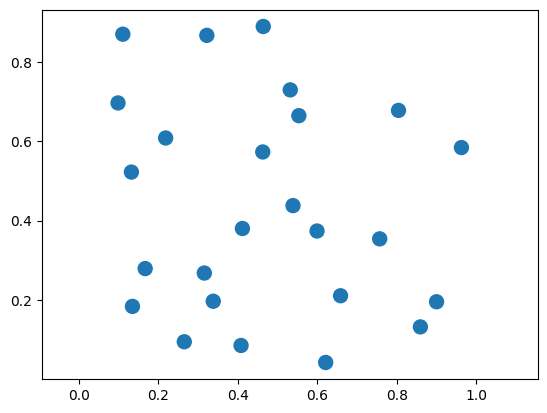
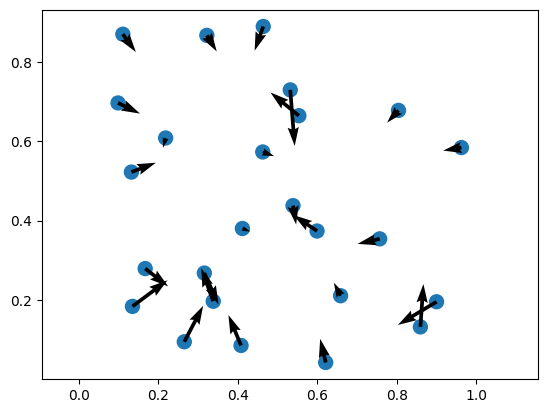

:::::: questions
- "How can we create and manipulate PyTorch tensors on a GPU?"
- "How can we move data between NumPy, CPU tensors, and GPU tensors?"
- "Why can PyTorch be useful for general-purpose GPU computing?"
::::::

:::::: objectives
- "Create PyTorch tensors and apply operations."
- "Understand the `@torch.compile` decorator and its limitations."
- "Compare the performance of PyTorch against other solutions."
::::::

# Introduction to PyTorch

PyTorch, often referred to as just _torch_, is a popular open-source Python library commonly used for machine learning and AI. It provides many features for working with N-dimensional arrays (called _tensors_), automatic differentiation, neural networks, and GPU acceleration. PyTorch was originally developed by Meta and is now maintained by the PyTorch Foundation, which is part of the Linux Foundation.

You can read more about PyTorch here: https://pytorch.org/

PyTorch has many features related to AI and training neural networks. However, in this episode, we will focus on running general-purpose code on the GPU using tensors.

## Getting started

First, we need to import `torch`:

~~~python
import torch
~~~

Next, we can check whether PyTorch detects a GPU:

~~~python
print("GPU available:", torch.cuda.is_available())
~~~

After this, we can create a device and print its name. The device determines where PyTorch stores data and performs computations. In our case, we will use `cuda:0`, which refers to the NVIDIA GPU with index 0.

~~~python
# Initialize the device
device = torch.device("cuda:0")

# Print the device name
name = torch.cuda.get_device_name(device)
print("GPU detected:", name)
~~~

This shows the full name of the GPU. For example:

~~~output
GPU detected: NVIDIA A100-SXM4-40GB MIG 3g.20gb
~~~

Next, we create a tensor. A tensor is similar to a NumPy array. We can create a tensor using `torch.tensor`, and place it on the GPU using `device=device`.

~~~python
# Create a tensor on the GPU containing the numbers [1, 2, 3, 4]
x = torch.tensor([1.0, 2, 3, 4], device=device)

# Print the number of elements
print(x.numel())

# Print the data type of the elements
print(x.dtype)
~~~

This should print `4` and `torch.float32`. Notice that PyTorch’s default floating-point type is usually 32-bit, while NumPy often defaults to 64-bit floating-point numbers. This is useful on GPUs, where 32-bit operations are usually faster. You can change the default floating-point dtype using `torch.set_default_dtype(torch.float64)`, which can be useful when matching NumPy code.

## Working with tensors

To convert a NumPy array into a PyTorch tensor, we can use `torch.from_numpy`. Note that the resulting PyTorch tensor will not copy the data, instead, it shares the same memory with the NumPy array. This means that modifying the PyTorch tensor will also change the contents of the original NumPy array.

The resulting tensor shares memory with the NumPy array.

To convert a tensor back into a NumPy array, we can use `tensor.cpu().numpy()`. Since NumPy arrays always live in CPU memory, CUDA tensors must first be copied back to the CPU using `.cpu()`.

~~~python
import numpy as np

# Create NumPy array
a = np.array([5, 6, 7, 8])

# Convert NumPy -> PyTorch tensor (CPU)
b = torch.from_numpy(a)

# Copy CPU -> GPU
c = b.to(device)

# Copy GPU -> CPU
d = c.cpu()

# Convert back to NumPy array
e = d.numpy()

# They should be equal
print(np.all(a == e))
~~~

This should print `True`, since the conversion from NumPy to PyTorch and back is lossless.

There are also many ways to create a tensor directly on the GPU. Many are similar to functions in NumPy. These functions create the data directly in GPU memory, without copying it from the CPU. Here are some examples.

~~~python
# Gives [0.0, 0.0, 0.0, 0.0, ...]
a = torch.zeros(10, device=device)

# Gives [1.0, 1.0, 1.0, 1.0, ...]
b = torch.ones(10, device=device)

# Gives [42.0, 42.0, 42.0, 42.0, ...]
c = torch.full((10,), 42.0, device=device)

# Gives [0.3226, 0.7758, 0.6456, ...]
d = torch.rand(10, device=device)

# Gives an uninitialized array
e = torch.empty(10, device=device)

# Gives [0, 1, 2, 3, 4, ...]
f = torch.arange(10, device=device)

# Gives [0.0000, 0.1111, 0.2222, 0.3333, ..., 1.0000]
g = torch.linspace(0, 1, 10, device=device)
~~~

Tensors can be multi-dimensional. They can be 1-dimensional (vectors), 2-dimensional (matrices), 3-dimensional (cubes), and so on.

~~~python
# This is a vector of length 3
x = torch.rand(3, device=device)

# This is a matrix of size 3x3
y = torch.rand((3, 3), device=device)

# This is a cube of size 3x3x3
z = torch.rand((3, 3, 3), device=device)
~~~

Slicing is also supported, similar to NumPy. For example, `m[i, :]` gives the $i$-th row and `m[:, j]` gives the $j$-th column of a matrix `m`. The result of slicing a tensor is again a tensor. Note that modifying this slice will also modify the original tensor, as it is a view.

~~~python
x = torch.rand(2, 3, device=device)

# Print the matrix
print("before:", x)

# Modify the first row
x[0, :] = 0

# Print the matrix
print("after:", x)
~~~

~~~output
before: tensor([[0.9707, 0.2220, 0.9106], [0.2907, 0.4936, 0.1780]], device='cuda:0')
after: tensor([[0.0000, 0.0000, 0.0000], [0.2907, 0.4936, 0.1780]], device='cuda:0')
~~~

Tensors also support many mathematical operations.

~~~python
x = torch.ones(5, device=device)
y = torch.arange(5, device=device)

print("x+y:", x + y)
print("x-y:", x - y)
print("x*y:", x * y)
print("x/y:", x / y)
print("sqrt:", torch.sqrt(y))
print("exp:", torch.exp(y))
print("sin:", torch.sin(y))
~~~

~~~output
x+y: tensor([1., 2., 3., 4., 5.], device='cuda:0')
x-y: tensor([ 1.,  0., -1., -2., -3.], device='cuda:0')
x*y: tensor([0., 1., 2., 3., 4.], device='cuda:0')
x/y: tensor([   inf, 1.0000, 0.5000, 0.3333, 0.2500], device='cuda:0')
sqrt: tensor([0.0000, 1.0000, 1.4142, 1.7321, 2.0000], device='cuda:0')
exp: tensor([ 1.0000,  2.7183,  7.3891, 20.0855, 54.5982], device='cuda:0')
sin: tensor([ 0.0000,  0.8415,  0.9093,  0.1411, -0.7568], device='cuda:0')
~~~

Be aware that you cannot mix NumPy arrays and GPU tensors in these operations. To do this, you either need to use `.cpu()` to convert your GPU tensor into a CPU tensor or, alternatively, copy your NumPy array into a GPU tensor.

~~~python
x = torch.rand(5, device=device)
y = np.arange(5)

# This is not allowed
try:
    print(x + y)
except Exception as e:
    print("error:", e)

# This returns a tensor on the CPU
print("CPU:", x.cpu() + y)

# This returns a tensor on the GPU
print("GPU:", x + torch.tensor(y, device=device))
~~~

~~~output
error: can't convert cuda:0 device type tensor to numpy. Use Tensor.cpu() to copy the tensor to host memory first.
CPU: tensor([0.6511, 1.7587, 2.4972, 3.3509, 4.5963])
GPU: tensor([0.6511, 1.7587, 2.4972, 3.3509, 4.5963], device='cuda:0')
~~~

## Example Using N-Body Simulation

Now, we will consider a larger example of how to use PyTorch. For this example, we consider `n` random planetary bodies and calculate the total gravitational force that each body experiences from the other bodies using [Newton's law of universal gravitation](https://en.wikipedia.org/wiki/Newton%27s_law_of_universal_gravitation).

First, we generate `n` random planets in a 2D plane. The `x` and `y` coordinates are chosen randomly in the range $[0, 1]$.

~~~python
n = 10
position = torch.rand((2, n), device=device)
mass = torch.rand(n, device=device) + 100
~~~

Let's plot the positions of the planets.

~~~python
%matplotlib inline
import matplotlib.pyplot as plt

plt.axis("equal")
plt.scatter(
    position[0,:].cpu(),
    position[1,:].cpu(),
    s=mass.cpu()
)
plt.show()
~~~

The force on planet $i$ is given by the following equation:

$\mathbf{F}_i = \sum_{j=1, j \neq i}^{N} G \frac{m_i m_j}{\|\mathbf{p}_j - \mathbf{p}_i\|^2} \left(\frac{\mathbf{p}_j - \mathbf{p}_i}{\|\mathbf{p}_j - \mathbf{p}_i\|}\right)$

Now, we can define a function that computes these forces between the planets.

~~~python
G = 6.67e-11

def calculate_forces(pos, mass):
    # r[:, i, j] = pos_j - pos_i
    diff = pos[:, None, :] - pos[:, :, None] # (2, N, N)

    # dist[i, j] = ||pos_j - pos_i||
    dist = diff.norm(dim=0)        # (N, N)
    dir = diff / dist

    # Force on i from j: F_ij = G * m_i * m_j * r_ij / |r_ij|^2
    forces = G * mass[:, None] * mass[None, :] / dist**2
    return (dir * forces[None, :, :]).nansum(dim=2)  # (2, N)
~~~

Finally, we can plot the results.

~~~python
forces = calculate_forces(position, mass)

plt.axis("equal")
plt.scatter(
    position[0,:].cpu(),
    position[1,:].cpu(),
    s=mass.cpu()
)

plt.quiver(
  position[0,:].cpu(),
  position[1,:].cpu(),
  forces[0,:].cpu(),
  forces[1,:].cpu()
)
~~~

## Using `torch.compile`

An important feature introduced in PyTorch 2.0 is the [`@torch.compile`](https://docs.pytorch.org/tutorials/intermediate/torch_compile_tutorial.html) decorator. This decorator can be applied to a Python function and tells PyTorch to compile the tensor operations inside the function into a more optimized version before executing it. Instead of running the function line by line in Python, PyTorch analyzes the operations inside the function and builds a more efficient computation graph. It can then apply various optimizations, such as fusing multiple operations together, reducing memory usage, and generating more efficient GPU kernels.

This process can significantly improve performance, especially for functions that perform many tensor operations. The compiled function can therefore run much faster than the original Python version while keeping the code easy to read and write.

Below is a simple example. We create two large tensors on the GPU and define a function that performs several mathematical operations on them. By adding the `@torch.compile` decorator, PyTorch will attempt to optimize the function automatically.

~~~python
@torch.compile
def compute(a, b):
    return (a + b) + torch.sin(a) * torch.cos(b)

a = torch.rand(1_000_000, device=device)
b = torch.rand(1_000_000, device=device)
c = compute(a, b)

print("result:", c)
~~~

This lets PyTorch optimize the `compute` function as a whole and makes the code faster than running the operations separately. It accomplishes this by tracing through your Python code and looking for PyTorch operations.

::::::::::::::::::::::::::::: instructor
The following section demonstrates how PyTorch compiles and fuses the operations in the computation graph. Instructors may choose to demonstrate this information to the class if time permits. However, it can also be skipped as it may be too advanced for learners new to GPU concepts.
::::::::::::::::::::::::::::::::::::::::

For example, to see what PyTorch is doing internally, we can use `set_logs`, which prints what happens under the hood.

~~~python
torch._logging.set_logs(graph_code=True)
compute(a, b)
~~~

This generates a large amount of output about the internals of PyTorch. You do not need to understand all the output. However, among this output is the following:

~~~output
...
[__graph_code] TRACED GRAPH
[__graph_code]  ===== __compiled_fn_139_120d693e_cd49_4b9d_8ed2_fa7094feea70 =====
[__graph_code]  /home/user/.local/lib/python3.13/site-packages/torch/fx/_lazy_graph_module.py class GraphModule(torch.nn.Module):
[__graph_code]     def forward(self, L_a_: "f64[1000000][1]cuda:0", L_b_: "f64[1000000][1]cuda:0"):
[__graph_code]         l_a_ = L_a_
[__graph_code]         l_b_ = L_b_
[__graph_code]         torch.sin(a) * torch.cos(b)
[__graph_code]         add: "f64[1000000][1]cuda:0" = l_a_ + l_b_
[__graph_code]         sin: "f64[1000000][1]cuda:0" = torch.sin(l_a_);  l_a_ = None
[__graph_code]         cos: "f64[1000000][1]cuda:0" = torch.cos(l_b_);  l_b_ = None
[__graph_code]         mul: "f64[1000000][1]cuda:0" = sin * cos;  sin = cos = None
[__graph_code]         add_1: "f64[1000000][1]cuda:0" = add + mul;  add = mul = None
[__graph_code]         return (add_1,)
...
~~~

This part shows how PyTorch has _traced_ our function `compute` as a graph of operations.

~~~output
...
[__kernel_code] @triton.jit
[__kernel_code] def triton_poi_fused_add_cos_mul_sin_0(in_ptr0, in_ptr1, out_ptr0, xnumel, XBLOCK : tl.constexpr):
[__kernel_code]     xnumel = 1000000
[__kernel_code]     xoffset = tl.program_id(0) * XBLOCK
[__kernel_code]     xindex = xoffset + tl.arange(0, XBLOCK)[:]
[__kernel_code]     xmask = xindex < xnumel
[__kernel_code]     x0 = xindex
[__kernel_code]     tmp0 = tl.load(in_ptr0 + (x0), xmask)
[__kernel_code]     tmp1 = tl.load(in_ptr1 + (x0), xmask)
[__kernel_code]     tmp2 = tmp0 + tmp1
[__kernel_code]     tmp3 = libdevice.sin(tmp0)
[__kernel_code]     tmp4 = libdevice.cos(tmp1)
[__kernel_code]     tmp5 = tmp3 * tmp4
[__kernel_code]     tmp6 = tmp2 + tmp5
[__kernel_code]     tl.store(out_ptr0 + (x0), tmp6, xmask)
...
~~~

This part shows that PyTorch automatically generated a GPU _kernel_ named `triton_poi_fused_add_cos_mul_sin_0` that performs all operations in one go, instead of having separate functions for each operation. The generated kernel uses [Triton](https://triton-lang.org/main/index.html), a Python-based language and compiler for GPU programming.

There are certain limitations to `@torch.compile`. For example, the inputs and outputs can only be PyTorch tensors, and you must be careful with loops (`for` statements) and conditionals (`if` statements). For more information, see the [guide](https://docs.pytorch.org/docs/stable/user_guide/torch_compiler/compile/programming_model.html) on the `torch.compile` programming model.

As an example, consider the following function that scales a tensor by `2` if the sum is positive and `-2` otherwise. Note that we pass the `fullgraph=True` option to force PyTorch to raise an error if it cannot compile.

~~~python
import torch

@torch.compile(fullgraph=True)
def fail_example(x):
    if x.sum() > 0:
        return x * 2
    else:
        return x * -2

fail_example(torch.rand(100, device=device))
~~~

This results in the following error:

~~~output
Unsupported: Data-dependent branching
  Explanation: Detected data-dependent branching (e.g. `if my_tensor.sum() > 0:`). Dynamo does not support tracing dynamic control flow.
  Hint: This graph break is fundamental - it is unlikely that Dynamo will ever be able to trace through your code. Consider finding a workaround.
  Hint: Use `torch.cond` to express dynamic control flow.

  Developer debug context: attempted to jump with TensorVariable()

 For more details about this graph break, please visit: https://meta-pytorch.github.io/compile-graph-break-site/gb/gb0170.html
~~~

The problem here is that PyTorch cannot statically determine whether to execute `x * 2` or `x * -2`, as this is dependent on the runtime value of `x.sum()`. 

Instead, for this example, we can use `torch.where` to select between them instead of having an if statement.

~~~python
import torch

@torch.compile(fullgraph=True)
def correct_example(x):
    condition = x.sum() > 0
    return torch.where(condition, x * 2, x * -2)

correct_example(torch.rand(100, device=device))
~~~

## Comparison of performance

Let's measure the time of our `calculate_forces` function with and without `@torch.compile` to compare the performance.

First, we import `%gpu_timeit` from `cupyx`.

~~~python
%load_ext cupyx.profiler
~~~

Next, we call our function with 10,000 planets.

~~~python
n = 10_000
pos = torch.rand(2, n, device=device)
mass = torch.rand(n, device=device)

%gpu_timeit -n50 calculate_forces(pos, mass)
~~~
~~~output
run:    CPU:   177.674 us   +/-  9.926 (min:   171.843 / max:   241.492) us
      GPU-0: 21880.586 us   +/- 11.218 (min: 21849.089 / max: 21906.431) us
~~~

The execution time on the GPU is around 21.880 milliseconds.

We can use `@torch.compile` to speed things up! Note how `@torch.compile` works recursively: if a function is compiled, all called functions are also compiled.

~~~python
n = 10_000
pos = torch.rand(2, n, device=device)
mass = torch.rand(n, device=device)

@torch.compile
def calculate_forces_fast(pos, mass):
    return calculate_forces(pos, mass)

forces = calculate_forces_fast(pos, mass);

%gpu_timeit -n50 calculate_forces_fast(pos, mass)
~~~
~~~output
run:    CPU:   114.750 us   +/- 23.757 (min:   106.006 / max:   277.980) us
      GPU-0:  4008.182 us   +/- 22.778 (min:  3997.696 / max:  4164.608) us
~~~

This time it takes around 4.008 milliseconds, a speedup of 5.5x over the original version!

As a comparison, we can also run the same function on the CPU using PyTorch:

~~~python
n = 10_000
pos = torch.rand(2, n, device="cpu")
mass = torch.rand(n, device="cpu")

%gpu_timeit -n1 calculate_forces_fast(pos, mass)
~~~
~~~output
run:    CPU: 608562.989 us     GPU-0: 608638.977 us
~~~

The CPU takes 608.563 milliseconds, meaning our GPU is around 152x faster than our CPU for this particular calculation!

::::::::::::::::::::::::::::::::::::::: challenge
Measure the performance of `calculate_forces_fast` for different numbers of planets. For example, `n = 2500`, `n = 5000`, `n = 10_000`, and `n = 20_000`. What timings do you expect? What do you get?

:::::::::::::::::::::::::::::::::::::: solution
The following times were measured (on your system they might be different!).

~~~output
421.274 us
1354.342 us
4965.478 us
18965.095 us
~~~

The results show that each time we double `n`, the execution time quadruples. This happens as the number of pairwise interactions between $n$ planets equals $n^2$.
::::::::::::::::::::::::::::::::::::::
::::::::::::::::::::::::::::::::::::::
